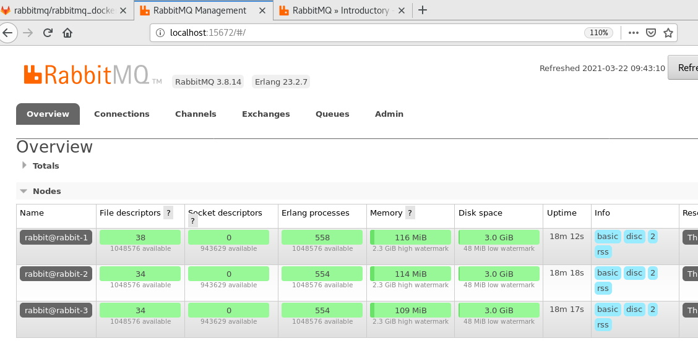
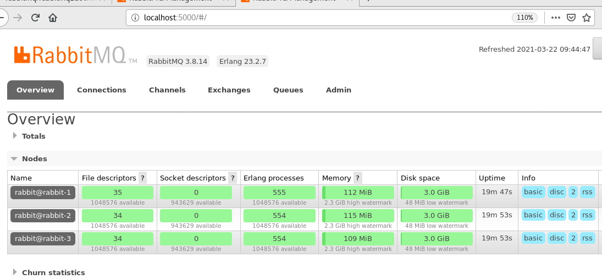

# nginx-rabbit-lb-docker
Using Nginx as load balancer with rabbitmq cluster

You might need to use nginx as load balancer in front of rabbitmq cluster for several reasons. In this project you will have this poc env with one nginx and three rabbitmqnodes as clustered within a few minutes thanks to docker compose. I used official nginx and rabbitmq images so you don't need to upgrade or maintain your images.

```
git clone 
https://github.com/erkansirin78/nginx-rabbit-lb-docker.git
cd nginx-rabbit-lb-docker
docker-compose up -d
```

Wait for a while then open up browser and http://localhost:15672/

## Via rabbitmq original port


## Via Nginx

http://localhost:5000/



## Send massage over nginx to rabbitmq cluster
You must install pika then run `python3 send.py`
- Expected output
```
0.675210586729196 1
 [x] 'Hello World!' 1
0.8036926221942016 2
 [x] 'Hello World!' 2
0.947042065578328 3
 [x] 'Hello World!' 3
0.2013505264099994 4
 [x] 'Hello World!' 4
0.43328363532393943 5
 [x] 'Hello World!' 5
 . . .
 . . .
```

## Receive message over nginx
`python3 receive.py`

- Expected output
```
[x] Received b'Hello World! - 1'
[x] Received b'Hello World! - 2'
[x] Received b'Hello World! - 3'
[x] Received b'Hello World! - 4'
[x] Received b'Hello World! - 5'
[x] Received b'Hello World! - 6'
[x] Received b'Hello World! - 7'
[x] Received b'Hello World! - 8'
[x] Received b'Hello World! - 9'
[x] Received b'Hello World! - 10'
. . .
. . .
```